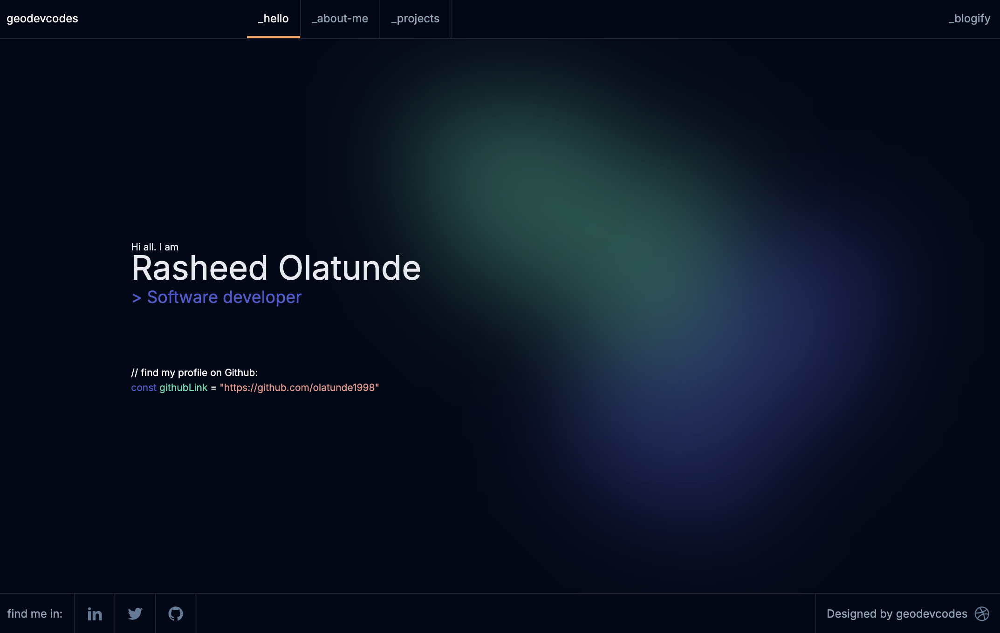

<h1>geodevcodes</h1>
<h6><i>I'm Rasheed Olatunde</i></h6>

Hellooooooooooo, 👋

I'm a Software Engineer with 4+ years of expertise in building high-performance web and mobile applications. Skilled in modern technologies and frameworks to deliver scalable, user-focused solutions. Known for strong leadership and the ability to simplify complex technical concepts for cross-functional teams.

1.  [Repository of my portfolio](https://github.com/geodevcodes/v2_portfolio)
2.  [Publicly hosted live URL of the portfolio](https://geodevcodes.vercel.app/)

# Technologies

- [NextJs,](https://nextjs.org/) [NextAuth](https://next-auth.js.org/)
- [React TanStack Query,](https://tanstack.com/query/latest)
- [TailwindCss](https://tailwindcss.com/)
- [React Hook-form](https://react-hook-form.com/)

# Prototype

# How to Contribute

1. Clone the repository
   `git clone https://github.com/geodevcodes/v2_portfolio.git`

2. Change directory into the `cloned folder ` and run the setup script
   `cd v2_portfolio`

3. Open your terminal and type this command `npm install ` to add the react dependency to the app in the development mode.

4. After the Successful installation of the dependency type/copy this command `npm run dev` to run the app in your local environment

5. Copy this link [http://localhost:3000/](http://localhost:3000/) and paste it to your web browser(Chrome, safari, mozilla firefox et.c) to view it.

# Deployment

Vercel was used to deploy the app.

- [Vercel](https://vercel.com/dashboard)

# License

The MIT License - Copyright (c) 2025 - Present, geodevcodes / Storage Service.

# Author

Rasheed Olatunde (Software Developer)
